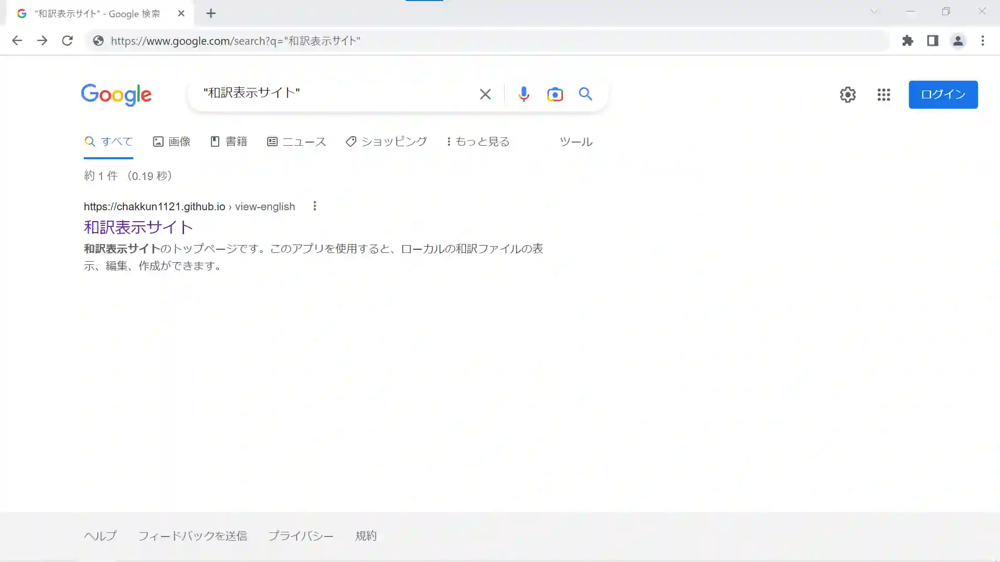
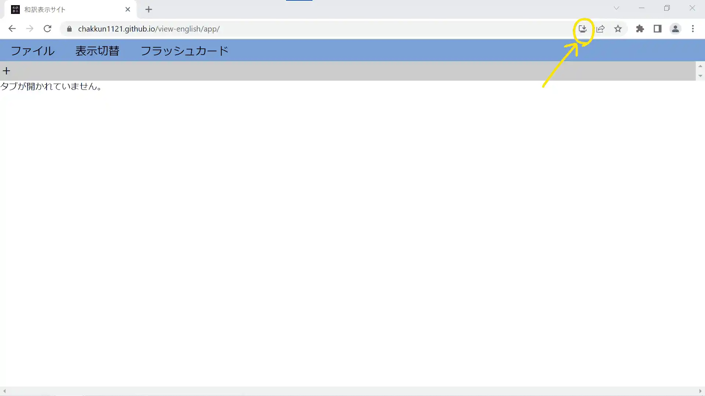

# 和訳表示サイトとは

和訳表示サイトはパソコンやスマートフォンに保存されている和訳ファイル(.wayaku)を開いたり、編集したりするアプリです。和訳ファイルの作成もこのアプリでできます。
アプリと名乗っていますが、実際はブラウザ(google chrome を推奨)上で動いているウェブアプリケーションとなっております。しかし、このアプリはインストールしてご使用いただけます。

↓google 検索でも出てくるようになりました

このアプリをインストールするにはまず、[和訳表示サイトアプリ](https://chakkun1121.github.io/view-english/)にアクセスします。

その後、インストールボタンを押してインストールします。

