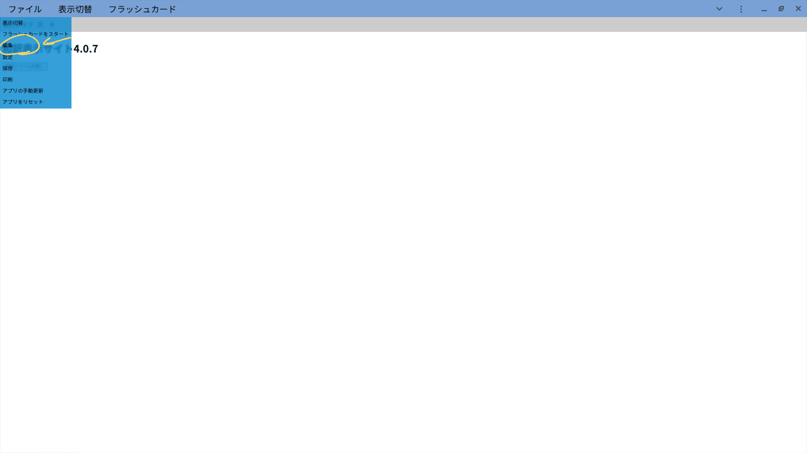
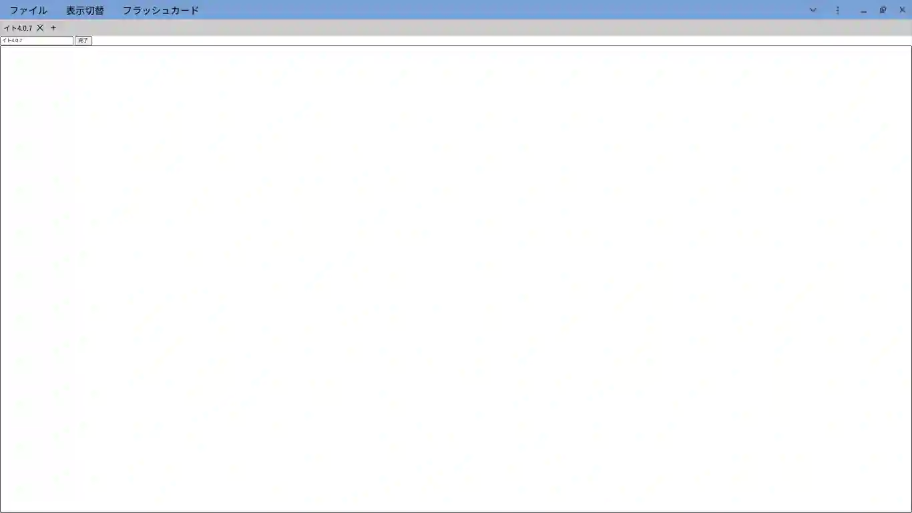

# 和訳表示サイトとは
和訳表示サイトはパソコンやスマートフォンに保存されている和訳ファイル(.wayaku)を開いたり、編集したりするアプリです。和訳ファイルの作成もこのアプリでできます。
アプリと名乗っていますが、実際はブラウザ(google chrome を推奨)上で動いているウェブアプリケーションとなっております。しかし、このアプリはインストールしてご使用いただけます。

↓google 検索でも出てくるようになりました

# 簡単な使い方
## 初期準備
このアプリをインストールするにはまず、[和訳表示サイトアプリ](https://chakkun1121.github.io/view-english/)にアクセスします。

(画像は開発中のものです。実際とは異なる場合があります。)

その後、インストールボタンを押してインストールします。

## 和訳ファイルの作成
最初に和訳ファイルの作成が必要なので新しいタブを開き(ctrl+tでもできます)そこで編集ボタンを押します。

そこにタイトル、本文を入力します。(タイトルのところが変になっているのはバグです。)

本文のところは英文、日本語訳の順に改行して入力します。(Excelなどからのコピペも対応しています。)

完了したら完了ボタンを押します。

その後、ファイル→保存として和訳ファイルをダウンロードします。

これで和訳ファイルの作成は完了です。
## 和訳ファイルを開く
和訳ファイルを開く際には新しいタブを開き、そこにある和訳ファイルを開くボタンから開くことができます。

また、アプリをインストールしていればエクスプローラーなどのファイルアプリから和訳ファイルの開く際のアプリとして登録できることもあります。その場合はいつものファイルを開く方法で和訳ファイルを開くことができます。
