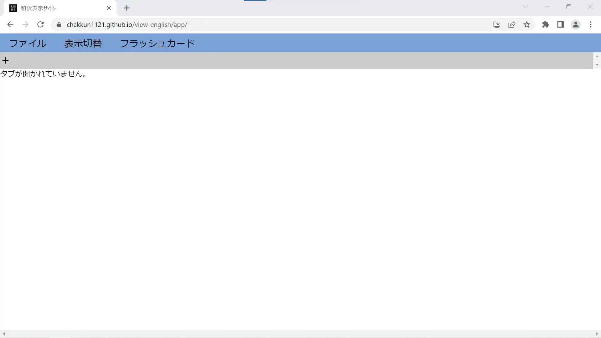
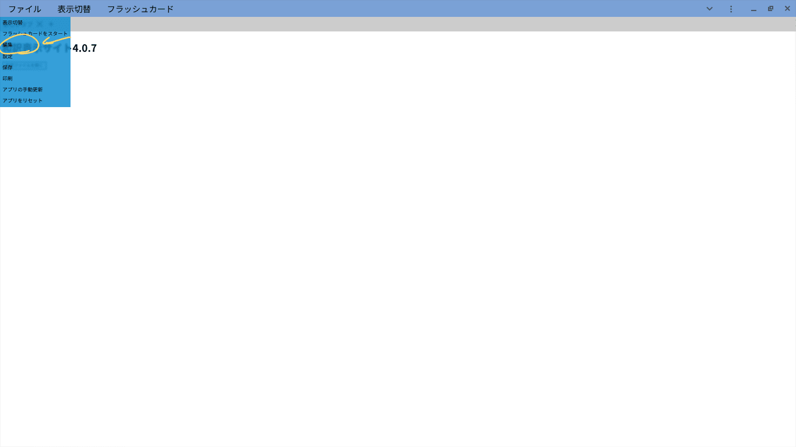
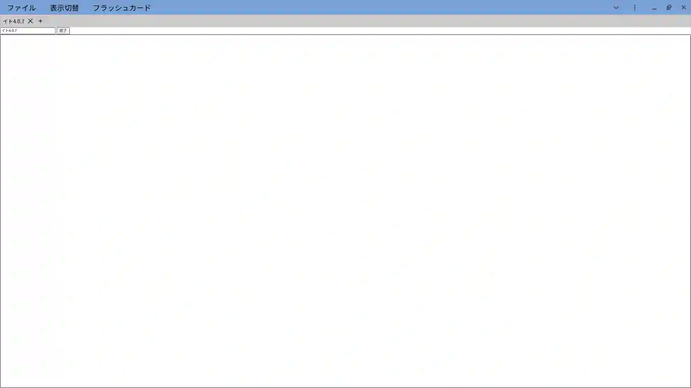
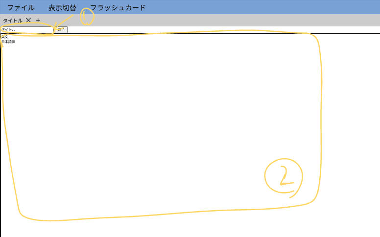

# 和訳ファイルの作成の仕方
1. 和訳表示サイトのアプリを開きます。(その後、必要なら[インストール](../install/)します。)

2. 左端にある+ボタン(以下では新しいタブを開くボタン)を押して新しいタブを開きます。
3. 左上にあるファイルボタンを押し、出てきたところのうち編集ボタンを押します。

4. その後出てきた編集画面でタイトル、本文を入力します。

(タイトルのところが変になっているのはバグです。)

上の画像の①の部分には、タイトルを②の部分に本文を入れます。詳しくは今ページの下のほうに書いてあります。
5. 編集が完了したら、完了ボタンを押します。そうすると和訳ファイルの表示ページに戻ります。
6. このままフラッシュカードなどをご利用いただけますが保存していないとデータが消える可能性があるので保存します。ファイルボタン→保存を押して、作成した和訳ファイルを保存します。chromeの場合、初期設定ではダウンロードフォルダーに勝手にダウンロードされますが、 chrome://settings/downloads で ダウンロード前に各ファイルの保存場所を確認する 有効にするとダウンロード時に好きなところへ保存ができます。

## 本文の入れ方
本文では英文、日本語訳を改行もしくはタブ区切りで入れます。
改行区切りで入れる例(空行はすべて無視されます。)

```
This is "view wayaku" web app.
こちらは和訳表示サイトです。
You can use this app to view your "wayaku" file and edit "wayaku" file.
和訳表示サイトを使うことで和訳ファイルの表示、編集ができます。
```

また、次のようにしたExcelなどの表計算ソフトからのコピペも対応しています。(下の表の場合は一番上の行は除いてください)

|英文|日本語訳|
|:--|:--|
|This is "view wayaku" web app.|こちらは和訳表示サイトです。|
|You can use this app to view your "wayaku" file and edit "wayaku" file.|和訳表示サイトを使うことで和訳ファイルの表示、編集ができます。|
